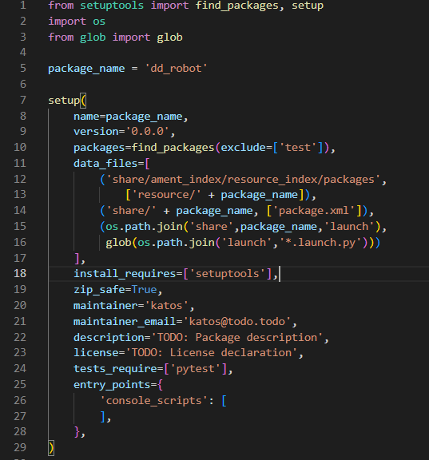
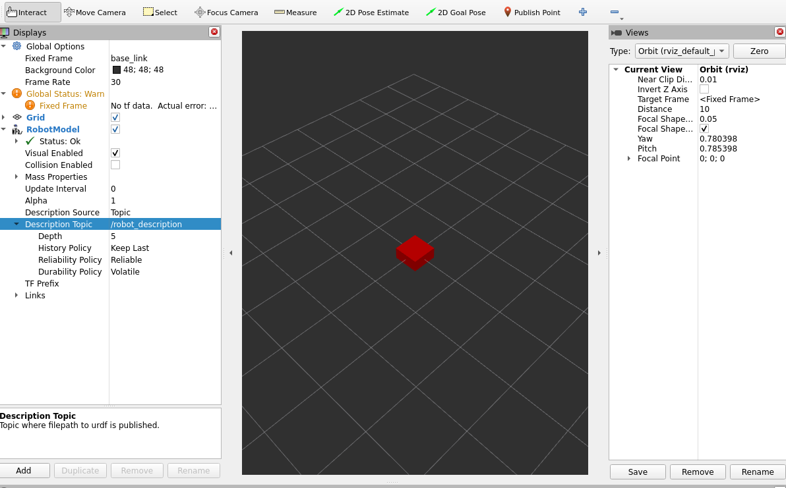
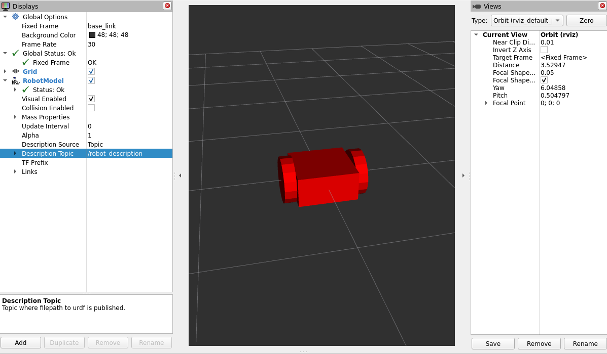
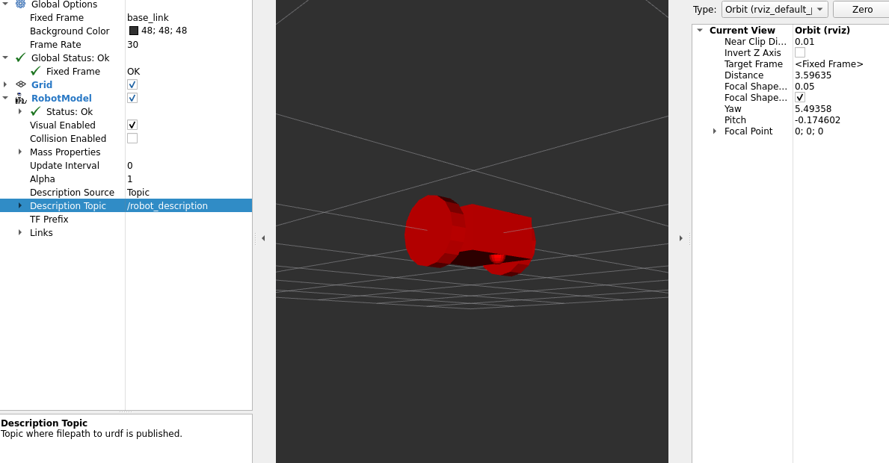
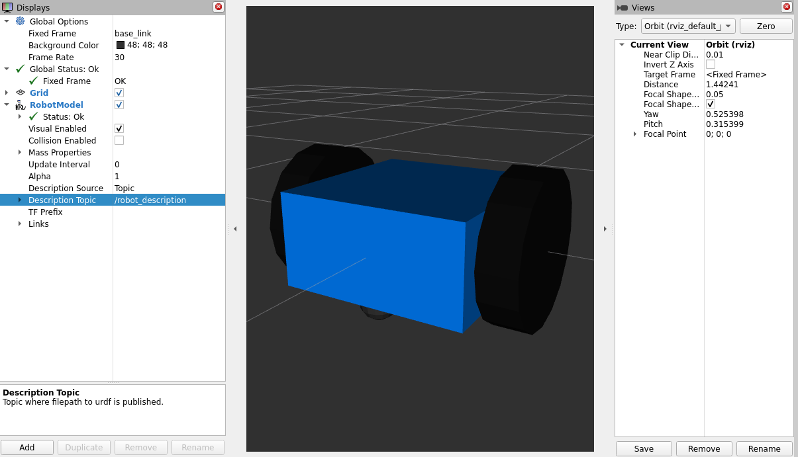
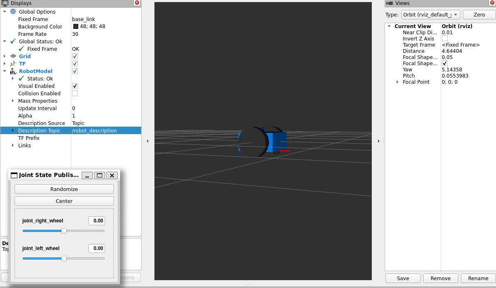
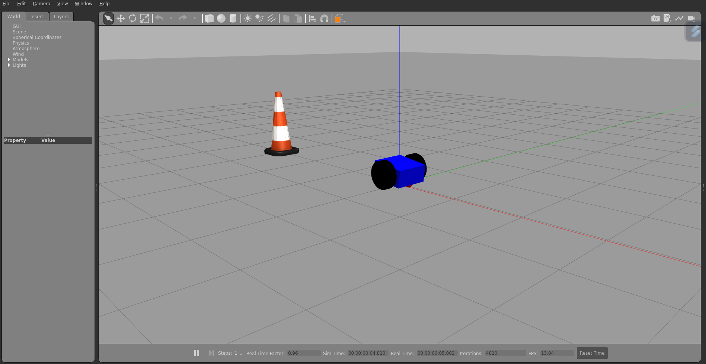

# Two wheel robot with Urdf and ROS 2

In this tutorial, we're going to build a visual model of a two-wheel robot. The tutorial will provide you with knowledge on how to construct a comprehensive robotic model from scratch. You will learn how to visualize your robot in Rviz and interact with its real behavior in the Gazebo Classic Simulator. In total, you will create seven robot models from scratch and develop two launch files that will integrate the robot into Rviz and spawn it into Gazebo.

--- 

Before creating your first ROS 2 package you must install ROS2, install the colcon tool and create a ros workspace. You can follow the instraction in the following links:
- [Install ROS 2 humble.](https://docs.ros.org/en/humble/Installation/Ubuntu-Install-Debians.html)
- [Install colcon to build packages.](https://docs.ros.org/en/humble/Tutorials/Beginner-Client-Libraries/Colcon-Tutorial.html)
- [Create a ROS 2 workspace.](https://docs.ros.org/en/humble/Tutorials/Beginner-Client-Libraries/Creating-A-Workspace/Creating-A-Workspace.html)


In the provided link, you'll discover a presentation guiding you through the installation of ROS2 and the colcon tool. The tutorial also covers the creation of a ROS 2 workspace, crucial for organizing and developing your robotics projects. Furthermore ROS 2 features are represented. 

- [Install ROS 2, Create ROS worksace.](https://docs.google.com/presentation/d/1xh91gPjNtocPdO5_trJKLcAcBAth0zTl/edit?usp=drive_web&ouid=106628092038381749227&rtpof=true) Greek Language.
- Install ROS2, Create ROS workspace. English Language. (comming soon)

Also make sure you have the joint_state_publihser package installed. 

## Create your first ROS 2 package.
We will create a package based on Python. The name of package is dd_robot:
```
cd ~/ros2_ws/src
ros2 pkg create --build-type ament_python dd_robot
```
For package organization we create the folders launch, urdf and wordls.
```
cd ~/ros2_ws/src/dd_robot
mkdir launch, urdf, worlds
```
For building the packages in ROS 2 you must informed the setup.py file. In  this file you should make the following changes.At first, add two python libraries. 
``` py
import os
from glob import glob 
``` 
Also you must add the following paths to the data_files Python list.
```py
(os.path.join('share',package_name,'launch'),
         glob(os.path.join('launch','*.launch.py'))),
(os.path.join('share',package_name,'urdf'),
         glob(os.path.join('urdf','*.urdf'))),
(os.path.join('share',package_name,'worlds'),
         glob(os.path.join('worlds','*.world'))),
```
The setup.py file of your package should look like this.



The following step is the building of the package.

```
cd ~/ros2_ws
colcon build packages-select dd_robot
```
## Create your first robot model 
In this chapter you will create your first robot model and you can check the behavior of the robot in Rviz. Also a laucnh file is introduced and by using them, the robot will be insert into Rviz.

Create a file named dd_robot.urdf in the folder urdf. 
```xml
<?xml version='1.0'?>
<robot name="dd_robot">
    <link name="base_link">
        <visual>
            <origin xyz="0 0 0" rpy="0 0 0" />
            <geometry>
                <box size="0.5 0.5 0.25"/>
            </geometry>
        </visual>
    </link>
</robot>
``` 
This code define a robot model name dd_robot. The robot has a link named base_link which is a box and its size is 0.5 width, 0.5 depth and 0.25 height.

Create a python file with the name dd_robot_rviz.launch.py. and saved it to the launch folder.

`pip install math`

```py
from ament_index_python.packages import get_package_share_path

from launch import LaunchDescription
from launch.actions import DeclareLaunchArgument
from launch.conditions import IfCondition, UnlessCondition
from launch.substitutions import Command, LaunchConfiguration

from launch_ros.actions import Node
from launch_ros.parameter_descriptions import ParameterValue

def generate_launch_description():
    dd_robot_path = get_package_share_path('dd_robot')
    default_model_path = dd_robot_path / 'urdf/ddrobot.urdf'
    

    gui_arg = DeclareLaunchArgument(name='gui', default_value='true', choices=['true', 'false'],
                                    description='Flag to enable joint_state_publisher_gui')
    model_arg = DeclareLaunchArgument(name='model', default_value=str(default_model_path),
                                      description='Absolute path to robot urdf file')
    
    robot_description = ParameterValue(Command(['xacro ', LaunchConfiguration('model')]),
                                       value_type=str)

    # Define all the Nodes which will start
    robot_state_publisher_node = Node(
        package='robot_state_publisher',
        executable='robot_state_publisher',
        parameters=[{'robot_description': robot_description}]
    )

    # You can use either joint state publisher or joint state publisher gui.
    # When you launch this file, give an extra argument.
    # gui = True for joint state publisher gui, False for joint state publisher. 
    joint_state_publisher_node = Node(
        package='joint_state_publisher',
        executable='joint_state_publisher',
        condition=UnlessCondition(LaunchConfiguration('gui'))
    )

    joint_state_publisher_gui_node = Node(
        package='joint_state_publisher_gui',
        executable='joint_state_publisher_gui',
        condition=IfCondition(LaunchConfiguration('gui'))
    )

    rviz_node = Node(
        package='rviz2',
        executable='rviz2',
        name='rviz2',
        output='screen',
    )

    return LaunchDescription([
        gui_arg,
        model_arg,
        joint_state_publisher_node,
        joint_state_publisher_gui_node,
        robot_state_publisher_node,
        rviz_node
    ])
```
The next step is building the package, source the environment and launch the dd_robot_rviz.launch.py file.
```
cd ~/ros2_ws
colcon build --packages-select dd_robot
source install/setup.py
# If you are using the Windows Subsystem for Linux (WSL) run the next command
export LIBGL_ALWAYS_SOFTWARE=1 LIBGL_ALWAYS_INDIRECT=0
ros2 launch dd_robot dd_robot_rviz.launch.py gui:='false'
```
The launch file will begin the Rviz2 gui. To see your robot make the following step:

- Select Add in the Displays Panel. 
- From the new gui select RobotModel.
- From the Displays Panel, select topic and change to /robot_description
- Change the Fixed Frame to base_link




## Adding wheels to robot model 
Now let's have a look at how to add multiple shapes/link and joints to your robot. First of all we will add two cylinders and add continuous joint. Create a second robot model name [dd_robot2.urdf](https://github.com/DimitrisKatos/dd_robot/blob/master/urdf/ddrobot2.urdf) in the urdf file of the package. 

Now you must visualize your robot to Rviz to ensure that the robot wheels are in correct position. Run the following commands:
```
cd ~/ros2_ws
colcon build --packages-select dd_robot
source install/setup.py
# If you are using the Windows Subsystem for Linux (WSL) run the next command
export LIBGL_ALWAYS_SOFTWARE=1 LIBGL_ALWAYS_INDIRECT=0
ros2 launch dd_robot dd_robot_rviz.launch.py mode:= urdf/dd_robot2.urdf gui:='false'
```
The launch file will start the Rviz and you must follow the above instraction to visualize the robot to 3-D environment. 



---
## Add a caster
After adding the wheeles of the robot, the next step is adding a caster for robots stability. The link and the joint are represented in the [dd_robot3.urdf](https://github.com/DimitrisKatos/dd_robot/blob/master/urdf/ddrobot3.urdf). Create a robot model named dd_robot3.urdf in the urdf folder. To visualize the robot model, run the above commands.



## Adding colors and collisions 
The first step is creating a robot model and give a specific color to a link. You will use the material tag to define color in term of red/green/blue/alpha, each in the range of [0,1]. The robot model is the [dd_robot4.urdf](https://github.com/DimitrisKatos/dd_robot/blob/master/urdf/ddrobot4.urdf). 



#### 
The next step is adding collision  to robot model. The robot model is the [dd_robot5.urdf](https://github.com/DimitrisKatos/dd_robot/blob/master/urdf/ddrobot5.urdf). There are no visual difference from the previous model. We just added the same geometry as in the visual properties. The collisions are crucial for Gazebo because is used to identify the boundaries of the object.
The next robot model is [dd_robot6.urdf](https://github.com/DimitrisKatos/dd_robot/blob/master/urdf/ddrobot6.urdf). In this model we add physical properties to robot such as mass and inertia based on the shape. The dd_robot6.urdf has't visual difference from the previus model. 
```
cd ~/ros2_ws
colcon build --packages-select dd_robot
source install/setup.py
# If you are using the Windows Subsystem for Linux (WSL) run the next command
export LIBGL_ALWAYS_SOFTWARE=1 LIBGL_ALWAYS_INDIRECT=0
ros2 launch dd_robot dd_robot_rviz.launch.py mode:= urdf/dd_robot6.urdf gui:='true'
```
Now you can see the graphical user interface of the joint state publhisher. With this gui you can ensure that your joints works in the desired way.


---

## dd_robot to Gazebo
Ros2 and Gazebo Classic communicate with some extra tags that called Gazebo tags. In this tutorial we will use Gazebo tags by adding colors to links in simulation. The new [dd_robot7.urdf]((https://github.com/DimitrisKatos/dd_robot/blob/master/urdf/ddrobot6.urdf)) model has some extra tags. The tags are the following:
```xml
  <gazebo reference="base_link">
    <material>Gazebo/Blue</material>
  </gazebo>

  <gazebo reference="right_wheel">
    <material>Gazebo/Black</material>
  </gazebo>

    <gazebo reference="left_wheel">
  <material>Gazebo/Black</material>
  </gazebo>

  <gazebo reference="caster">
    <material>Gazebo/Red</material>
  </gazebo>
```
For spawning the robot model to Gazebo we need to create a world. In the worlds folder create the [ddrobot.world](https://github.com/DimitrisKatos/dd_robot/blob/master/worlds/ddrobot.world).
```xml
<?xml version="1.0" ?>
<sdf version="1.6">
  <world name="default">
    <include>
      <uri>model://ground_plane</uri>
    </include>
    <include>
      <uri>model://sun</uri>
    </include>
    <include>
      <uri>model://construction_cone</uri>
      <name>construction_cone</name>
      <pose>-3.0 0 0 0 0 0</pose>
    </include>
  </world>
</sdf>
```

The following step is creating a new launch file. This file is capable of spawning the dd_robot7.urdf model to a gazebo world.
Create a new python script in the launch folder with and named it dd_robot_gazebo.launch.py.
```py
import os
from ament_index_python.packages import get_package_share_directory
from launch import LaunchDescription
from launch.actions import IncludeLaunchDescription
from launch.launch_description_sources import PythonLaunchDescriptionSource
from launch.actions import ExecuteProcess


from launch_ros.actions import Node
import xacro

def generate_launch_description():

    # Specify the name of the package and path to xacro file within the package
    pkg_name = 'dd_robot'
    file_subpath = 'urdf/ddrobot7.urdf'
    world_subpath= 'worlds/ddrobot.world'

    # Use xacro to process the file
    xacro_file = os.path.join(get_package_share_directory(pkg_name),file_subpath)
    world_path = os.path.join(get_package_share_directory(pkg_name),world_subpath)
    robot_description_raw = xacro.process_file(xacro_file).toxml()

    # Configure the node
    node_robot_state_publisher = Node(
        package='robot_state_publisher',
        executable='robot_state_publisher',
        output='screen',
        parameters=[{'robot_description': robot_description_raw,
        'use_sim_time': True}] # add other parameters here if required
    )

    spawn_entity = Node(package='gazebo_ros', executable='spawn_entity.py',
                    arguments=['-topic', 'robot_description',
                                '-entity', 'ddrobot'],
                    output='screen')

    # Run the node
    return LaunchDescription([
        ExecuteProcess(cmd=['gazebo', '--verbose', '-s', 'libgazebo_ros_init.so', '-s', 'libgazebo_ros_factory.so', world_path], output='screen'),
        node_robot_state_publisher,
        spawn_entity
    ])

```
The following steps is launching this file. You need to run the following commands.
```
cd ~/ros2_ws
colcon build
# For WSL you must run the next command.
export LIBGL_ALWAYS_SOFTWARE=1 LIBGL_ALWAYS_INDIRECT=0
cd ~/ros2_ws/scr/dd_robot
ros2 launch dd_robot dd_robot_gazebo.launch.py
```


